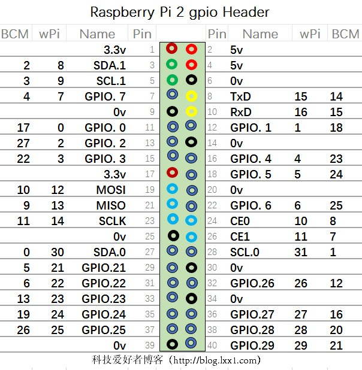

# rpi-sensor
## 树莓派传感器合集
## 注意：只能适合40PIN的树莓派,其余类型，需要自己手动修改lib/comm.js下的GPIO_MAPPING
## API中声明传感器实例对象的所有no参数，全部使用GPIO的物理引脚编号（即按顺序数编号），非BCM编号、Pin编号，这样可以方便没有对应图的情况使用

------------



------------

### 安装方式

#### 1、安装BCM2835(如果没有安装过)
    $ wget https://raw.githubusercontent.com/zhou090221liang/rpi-sensor/master/Resource/bcm2835-1.58.tar.gz
    $ tar -zxvf bcm2835-1.58.tar.gz
    $ cd bcm2835-1.58
    $ ./configure
    $ make
    $ sudo make check
    $ sudo make install

#### 2、安装依赖
    $ sudo apt-get update
    $ sudo apt-get install pigpio
    $ sudo apt-get install ttf-wqy-zenhei
    $ sudo apt-get install build-essential libcairo2-dev libpango1.0-dev libjpeg-dev libgif-dev librsvg2-dev

#### 3、安装该模块
    $ npm i rpi-sensor

#### 4、重新编译各个支持你硬件及Node版本的固件
    $ chmod +x node_modules/node-dht-sensor/check-lib.sh 
    $ npm rebuild

------------

### 已经实现的功能列表
    1、DHT11/DHT22温湿度传感器 >= v0.1.0
        可以检测当前温度与湿度
    2、触摸按键模块传感器 >= v0.2.0
        可以实时监控触摸按钮的按下与松开，并可以实现按钮的长按，短按
    3、触摸按键模块传感器2 >= v0.3.0
        可以实时监控触摸按钮的长按，短按、双击
    4、SSD1306显示屏 >= v0.4.0

------------

### Node版本支持
    >=6.x

------------

### API
#### 首先，需要声明对象
```javascript
const sensor = require('rpi-sensor');
```

#### DHT11/DHT22 温湿度传感器
##### 创建一个DHT11或DHT22传感器
```javascript
new sensor.DHT11(no);
new sensor.DHT22(no);
```

###### 示例：
```javascript
const dht11 = new sensor.DHT11(7);
```

##### 从传感器读取当前的温湿度数值
```javascript
dht11.read();
```

###### 该方法无需参数，返回值为JSON
| 参数名称    | 参数类型 | 参数说明                             |
| ----------- | -------- | ------------------------------------ |
| humidity    | number   | 当前湿度百分比                       |
| temperature | number   | 当前温度（摄氏度°C）                 |
| isValid     | bool     | 传感器返回的校验值和温湿度值是否匹配 |
| errors      | number   | 错误，目前返回0                      |
###### 返回值示例：
```javascript
{
    humidity: 32, 
    temperature: 31, 
    isValid: true, 
    errors: 0 
}
```

#### 触摸按键-目前测试通过的是TTP223，其余设备请自己测试
##### 创建一个触摸按键传感器
```javascript
new sensor.TOUCH_KEY(no [,setting]);
```

###### 参数setting为一个JSON格式的配置项
| 参数名称        | 参数类型 | 参数说明                                                                                                                                              |
| --------------- | -------- | ----------------------------------------------------------------------------------------------------------------------------------------------------- |
| TYPE            | enum     | 设备类型,可以有多个方式:<br>UNLOCK_HIGHT:点动高电平输出（默认）<br> LOCK_HIGHT:自锁高电平输出<br>UNLOCK_LOW:点动低电平输出<br>LOCK_LOW:自锁低电平输出 |
| LONG_TOUCH_TIME | number   | 当持续按下长达500毫秒（默认值）后松开，设备默认为长按                                                                                                 |

###### 示例：
```javascript
const touchkey = new sensor.TOUCH_KEY(12, {
    TYPE: sensor.TOUCH_KEY_TYPE.UNLOCK_HIGHT,
    LONG_TOUCH_TIME: 300
});
```

##### 监听按钮按下、松开状态
```javascript
TOUCH_KEY.key.on('touch',callback)
```

###### 以事件监听的方式，获取按钮按下、松开状态，callback返回一个JSON
| 参数名称 | 参数类型 | 参数说明                                              |
| -------- | -------- | ----------------------------------------------------- |
| touch    | bool     | true代表按下状态；false代表松开状态                   |
| long     | bool     | 当touch为松开状态时，该字段标示是否为长按后松开       |
| time     | number   | 当touch为松开状态时，该字段表示从按下到松开后的毫秒数 |

###### 返回值示例：
```javascript
{ 
    touch: false, 
    long: false, 
    time: 265 
}
```

#### 触摸按键2-目前测试通过的是TTP223,稳定性一般,其余设备请自己测试
##### 创建一个触摸按键传感器
```javascript
new sensor.TOUCH_KEY2(no [,setting]);
```

###### 参数setting为一个JSON格式的配置项
| 参数名称          | 参数类型 | 参数说明                                                                                    |
| ----------------- | -------- | ------------------------------------------------------------------------------------------- |
| TYPE              | enum     | 设备类型,可以有2个方式:<br>UNLOCK_HIGHT:点动高电平输出（默认）<br>UNLOCK_LOW:点动低电平输出 |
| LONG_TOUCH_TIME   | number   | 当持续按下长达500毫秒（默认值）后松开，设备默认为长按                                       |
| DOUBLE_TOUCH_TIME | number   | 当2次连续触摸时间少于200毫秒(默认值)，设备默认为双击                                        |

###### 示例：
```javascript
const touchkey = new sensor.TOUCH_KEY2(12, {
    TYPE: sensor.TOUCH_KEY_TYPE.UNLOCK_HIGHT,
    LONG_TOUCH_TIME: 500,
    DOUBLE_TOUCH_TIME: 200
});
```

##### 监听按钮按下、松开状态
```javascript
TOUCH_KEY.key.on('touch',callback)
```

###### 以事件监听的方式，获取按钮按下、松开状态，callback返回一个JSON
| 参数名称 | 参数类型 | 参数说明     |
| -------- | -------- | ------------ |
| double   | bool     | true代表双击 |
| long     | bool     | true代表长按 |

注意：double和long同时为false时，代表正常的短按


###### 返回值示例：
```javascript
{ 
    double: false, 
    long: false
}
```

#### SSD1306显示屏
##### 创建一个SSD1306显示器传感器
```javascript
new sensor.SSD1306(i2cNumber, address, width, height);
```

| 参数名称  | 参数类型 | 参数说明              |
| --------- | -------- | --------------------- |
| i2cNumber | number   | I2C总线编号，默认1    |
| address   | number   | I2C总线地址，默认0x3C |
| width     | number   | 显示屏宽像素，默认128 |
| height    | number   | 显示屏高像素，默认64  |

###### 示例：
```javascript
const ssd1306 = new sensor.SSD1306(1, 0x3C, 128, 64);
```

##### 打开显示器（自发光显示器不会亮，必须有输出后才能亮起）
```javascript
ssd1306.oled.turnOnDisplay();
```

##### 关闭显示器
```javascript
ssd1306.oled.turnOffDisplay();
```

##### 清除显示器所有像素点
```javascript
ssd1306.oled.clearDisplay();
```
##### 在屏幕上显示文字（只能支持大小写英文、英文标点符号）
```javascript
ssd1306.oled.setCursor(x, y);
ssd1306.oled.writeString(font, size,text,color,wrapping);
```
| 参数名称 | 参数类型 | 参数说明                              |
| -------- | -------- | ------------------------------------- |
| x        | number   | 需要输出文字的起始位置，x坐标值       |
| y        | number   | 需要输出文字的起始位置，y坐标值       |
| font     | object   | 请固定传ssd1306.font                  |
| size     | number   | 文字大小缩放倍率                      |
| text     | string   | 需要显示的文字                        |
| color    | number   | 文字的颜色，对于单色显示器，请固定传1 |
| wrapping | bool     | 是否自动换行(基于单词、空格)          |

##### 在屏幕上显示汉字
```javascript
//参数为Array数组,每个元素代表1行，汉字一行最多显示6个，最多3行
ssd1306.oled.writeChinese(text)
```
| 参数名称 | 参数类型 | 参数说明     |
| -------- | -------- | ------------ |
| text     | string   | 需要输出文字 |

##### 更多API，请参考I2C标准 https://www.npmjs.com/package/oled-i2c-bus