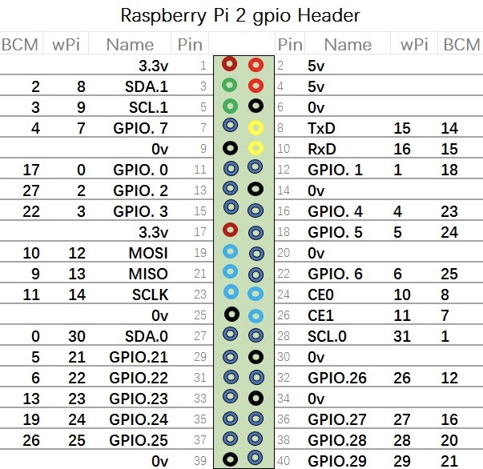

# rpi-sensor
## 树莓派传感器合集
## 注意：只能适合40PIN的树莓派,其余类型，需要自己手动修改lib/comm.js下的GPIO_MAPPING
## API中声明传感器实例对象的所有no参数，全部使用GPIO的物理引脚编号（即按顺序数编号），非BCM编号、Pin编号，这样可以方便没有对应图的情况使用

### 安装方式

#### 1、安装BCM2835(如果没有安装过)
    $ wget https://raw.githubusercontent.com/zhou090221liang/rpi-sensor/master/Resource/bcm2835-1.58.tar.gz
    $ tar -zxvf bcm2835-1.58.tar.gz
    $ cd bcm2835-1.58
    $ ./configure
    $ make
    $ sudo make check
    $ sudo make install

#### 2、安装pigpio的C语言库
    sudo apt-get update
    sudo apt-get install pigpio

#### 3、安装该模块
    $ npm i rpi-sensor

### 已经实现的功能列表
    1、DHT11/DHT22温湿度传感器 >= v0.1.0
        可以检测当前温度与湿度
    2、触摸按键模块传感器 >= v0.2.0
        可以实时监控触摸按钮的按下与松开，并可以实现按钮的长按，短按

### Node版本支持
    >= 6.x

### API
#### 首先，需要声明对象
	const sensor = require('rpi-sensor');
#### DHT11/DHT22 温湿度传感器
##### 创建一个DHT11或DHT22传感器

	new sensor.DHT11(no);
	new sensor.DHT22(no);

###### 示例：

	const dht11 = new sensor.DHT11(7);

##### 从传感器读取当前的温湿度数值

	dht11.read();

###### 该方法无需参数，返回值为JSON

| 参数名称    | 参数类型 | 参数说明                             |
| ----------- | -------- | ------------------------------------ |
| humidity    | int      | 当前湿度百分比                       |
| temperature | int      | 当前温度（摄氏度°C）                 |
| isValid     | bool     | 传感器返回的校验值和温湿度值是否匹配 |
| errors      | int      | 错误，目前返回0                      |

###### 返回值示例：
	{
        humidity: 32, 
        temperature: 31, 
        isValid: true, 
        errors: 0 
    }

#### 触摸按键-目前测试通过的是TTP223，其余设备请自己测试
##### 创建一个触摸按键传感器

	new sensor.TOUCH_KEY(no [,setting]);

###### 参数setting为一个JSON格式的配置项

| 参数名称          | 参数类型 | 参数说明                                                                                                                                              |
| ----------------- | -------- | ----------------------------------------------------------------------------------------------------------------------------------------------------- |
| TYPE              | enum     | 设备类型,可以有多个方式: UNLOCK_HIGHT:点动高电平输出（默认）  LOCK_HIGHT:自锁高电平输出 UNLOCK_LOW:点动低电平输出 LOCK_LOW:自锁低电平输出 |
| LONG_TOUCH_TIME   | int      | 当持续按下长达500毫秒（默认值）后松开，设备默认为长按                                                                                                 |

###### 示例：

	const touchkey = new sensor.TOUCH_KEY(12, {
        TYPE: sensor.TOUCH_KEY_TYPE.UNLOCK_HIGHT,
        LONG_TOUCH_TIME: 300
    });

##### 监听按钮按下、松开状态

	TOUCH_KEY.key.on('touch',callback)

###### 以事件监听的方式，获取按钮按下、松开状态，callback返回一个JSON

| 参数名称 | 参数类型 | 参数说明                                              |
| -------- | -------- | ----------------------------------------------------- |
| touch    | bool     | true代表按下状态；false代表松开状态                   |
| long     | bool     | 当touch为松开状态时，该字段标示是否为长按后松开       |
| time     | int      | 当touch为松开状态时，该字段表示从按下到松开后的毫秒数 |

###### 返回值示例：
	{ 
        touch: false, 
        long: false, 
        time: 265 
    }